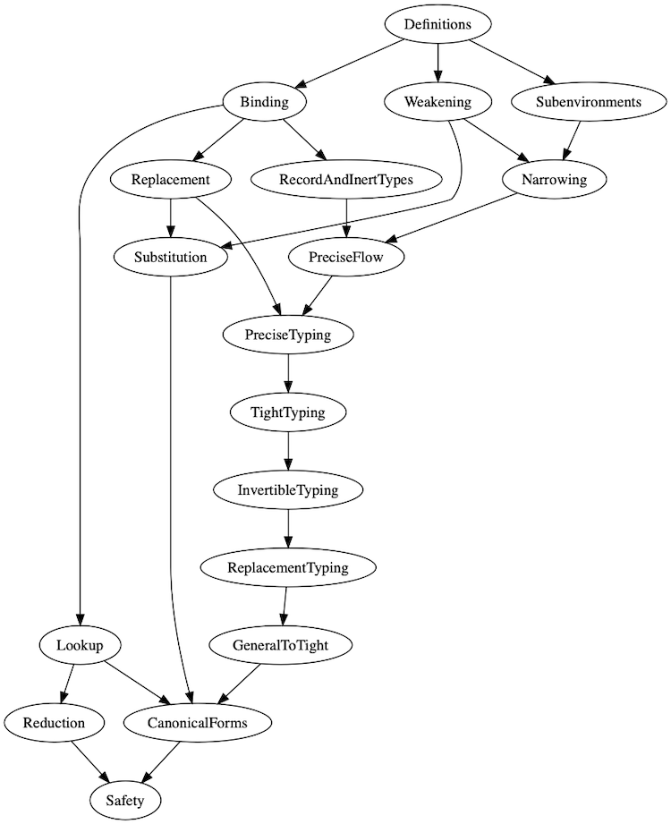

pDOT Type Safety Proof
======================

Supplemental material for the paper
**_A Path To DOT: Formalizing Fully Path-Dependent Types_**

This directory contains the Coq formalization type-safety proof of
the pDOT calculus that generalizes DOT by
[Amin et al. (2016)](https://infoscience.epfl.ch/record/215280)
with paths of arbitrary length. This allows
us to express path-dependent types of the form `x.a.b.A` as opposed to 
just `x.A`.

## Compiling the Proof

To compile the proof, we require `coq 8.9.0` and related tooling to be
run in a unix-like environment.

Other requirements are:
  * make
  * the [`TLC`](https://gitlab.inria.fr/charguer/tlc) library which can 
  be installed through 

    ```
    opam install coq-tlc.20181116
    ```

To compile the proof, navigate to the unzipped archive directory and run

    cd proof
    make

`make` will do the following:

- compile the [`lc`](src/lc) (Software Foundations) and
    [`leroy`](src/leroy) (Xavier Leroy's `Sequences`) libraries that 
    are located in
    the [`src`](src) folder
- compile the pDOT safety proof

### Proof Organization

#### Safety Proof
The Coq proof is split up into the following modules:
  * **[Definitions.v](paths/proof/Definitions.v)**: Definitions of pDOT's 
    abstract syntax and type system.
  * **[OperationalSemantics.v](paths/proof/OperationalSemantics.v)**: 
    Normal forms and the operational semantics of pDOT.
  * **[Safety.v](paths/proof/Safety.v)**: ***Final safety theorem*** 
    through Progress and Preservation.
  * [Lookup.v](paths/proof/Lookup.v): Definition of path lookup and
    properties of lookup.  
  * [Binding.v](paths/proof/Binding.v): Lemmas related to opening and 
    variable binding.
  * [SubEnvironments.v](paths/proof/SubEnvironments.v): Lemmas related to 
    subenvironments.
  * [Weakening.v](paths/proof/Weakening.v): Weakening Lemma.
  * [RecordAndInertTypes.v](paths/proof/RecordAndInertTypes.v): Lemmas 
    related to record and inert types.
  * [Replacement.v](paths/proof/Replacement.v): Properties of equivalent 
    types.
  * [Narrowing.v](paths/proof/Narrowing.v): Narrowing Lemma.
  * [PreciseFlow.v](paths/proof/PreciseFlow.v) and 
    [PreciseTyping.v](paths/proof/PreciseTyping.v): Lemmas related to 
    elimination typing. In particular, reasons about the possible 
    precise types that a path can have in an inert environment.
  * [TightTyping.v](paths/proof/TightTyping.v): Defines tight typing and 
    subtyping.
  * [Substitution.v](paths/proof/Substitution.v): Proves the Substitution 
    Lemma.
  * [InvertibleTyping.v](paths/proof/InvertibleTyping.v) and 
    [ReplacementTyping.v](paths/proof/ReplacementTyping.v): Lemmas related to 
    introduction typing.
  * [GeneralToTight.v](paths/proof/GeneralToTight.v): Proves that in an 
    inert context, general typing implies tight typing.
  * [CanonicalForms.v](paths/proof/CanonicalForms.v): Canonical Forms 
    Lemma.
  
#### Path Safety Proof
  
* **[Safety.v](paths/proof/Safety.v)**: Proves that well-typed paths
    are either cyclic or reduce to values.

#### Examples

  * [CompilerExample.v](paths/proof/CompilerExample.v): The dotty-compiler
    example that contains paths of length greater than one.
  * [ListExample.v](paths/proof/ListExample.v): A covariant-list
    implementation.
  * [SingletonTypeExample.v](paths/proof/SingletonTypeExample.v):
    Method chaining through singleton types.
  * [ExampleTactics.v](paths/proof/ExampleTactics.v]: Helper tactics to prove
    the above examples.
    
<!--The following figure shows a dependency graph between the Coq modules:-->

<!---->

#### Paper Correspondence

The pDOT calculus is formalized using the [locally nameless
representation](http://www.chargueraud.org/softs/ln/)
with cofinite quantification
in which free variables are represented as named variables,
and bound variables are represented as de Bruijn indices. 

- pDOT's **abstract syntax** (Figure 1) 
    is defined in [Definitions.v](paths/proof/Definitions.v):
    * variable: `avar`
    * term member: `trm_label`
    * type member: `typ_label`
    * path: `path`
    * term: `trm`
    * stable term: `def_rhs`
    * value: `val`
    * definition: `def`
    * type: `typ`
- pDOT **type system** (Figure 2)
    is defined in [Definitions.v](paths/proof/Definitions.v):
    * term typing (Γ ⊢ t: T): `ty_trm`, notation: `Γ ⊢ t : T`
    * definition typing (p; Γ ⊢ d: T): `ty_def` and `ty_defs` for single
        and multiple definitions; notations: `x; bs; Γ ⊢ d : T` and
        `x; bs; G ⊢ d :: T`, where `x` is the receiver of the
        path and `bs` is the list of p's fields in *reverse* order.
        For example, a path x.a.b.c will be represented as
        x; \[c, b, a\]
    * tight bounds: `tight_bounds` function
    * subtyping (Γ ⊢ T <: U): `subtyp`, notation: `Γ ⊢ T <: U`
- pDOT's **operational semantics** (Figure 3) 
    defined in [OperationalSemantics.v](paths/proof/OperationalSemantics.v):
    * reduction relation (γ | t ↦ γ' | t'):
        `red'`, notation: `(γ, t) |=> (γ', t')`,
- **Path lookup** (Figure 4):
    * lookup relation (γ ⊢ p ⤳ s ):
        `lookup_step`, notation: `γ ⟦ p ⟼ s ⟧`,
        defined in 
        [Lookup.v](paths/proof/Lookup.v)
    * reflexive, transitive closure of lookup relation (γ ⊢ s ⤳* s' ):
        `lookup`, notation: `γ ⟦ s ⟼* s' ⟧`;
        we also define special notation for a lookup that results
        in a value: `γ ∋ (p, v)`;
        defined in 
        [Lookup.v](paths/proof/Lookup.v)    
- **Inert** types (Figure 5)
    defined in [Definitions.v](paths/proof/Definitions.v):
    * inert types: `inert_typ`
    * records `record_typ` and `record_dec`
    * inert contexts: `inert`
- **Well-formed** environments are defined in 
    [PreciseTyping.v](paths/proof/PreciseTyping.v) as `wf_env`
- **Correspondence** between a value and typing environment
    (γ: Γ) is represented as `well_typed Γ γ`,
    [Definitions.v](paths/proof/Definitions.v): 
- **Theorems**:
    In the progress and preservation lemmas,
    we use the `sta_trm_typ` judgment with a notation `⊢ (γ, t): T` to 
    denote that for some inert, well-typed environment Γ such that
    γ: Γ, Γ ⊢ t: T.
  * Theorem 5.1 (**Soundness**): `safety` in [Safety.v](paths/proof/Safety.v)
  * Lemma 5.2 (Progress): `progress` in [Safety.v](paths/proof/Safety.v)
  * Lemma 5.3 (Preservation): `preservation` in [Safety.v](paths/proof/Safety.v)
  * Lemma 5.4: `canonical_forms_fun` in 
    [CanonicalForms.v](paths/proof/CanonicalForms.v).
  
      
    